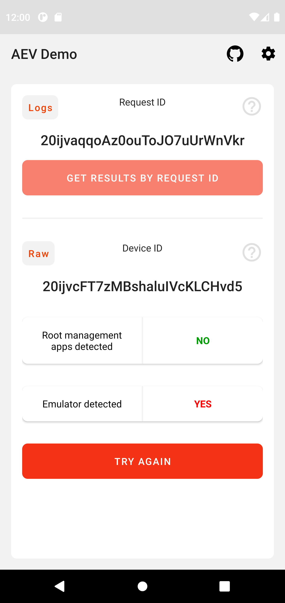

<p align="center">
  <a href="https://fingerprintjs.com">
    
  </a>
</p>
<p align="center">
  <a href="https://discord.gg/39EpE2neBg">
    
  </a>
</p>
<p align="center">
    <a href="https://android-arsenal.com/api?level=21">
    
  </a>
</p>


# Android Application Environment Verification API

Android library to verify application environments. 

Make sure every API call from a device is safe and trusted. 

Instantly detect rooted devices or emulators. 

The library sends a set of signals to the server.

The server verifies safety of the application environment.


## Table of Contents
1. [Quick start](#quick-start)
2. [API token](#get-an-api-token)
3. [Demo App](#demo-app)


## Quick start

### Add the repository to the build.gradle.

If your version of Gradle is earlier than 7, add these lines to your `build.gradle`.


```gradle
allprojects {	
  repositories {
  ...
  maven { url 'https://jitpack.io' }	
}}
```

If your version of Gradle is 7 or newer, add these lines to your `settings.gradle`.
```gradle
repositories {
  ...
  maven { url "https://jitpack.io" }
}
```

### Add dependencies

This library depends on [kotlin-stdlib](https://kotlinlang.org/api/latest/jvm/stdlib/), [fingerprint-android](https://github.com/fingerprintjs/fingerprint-android) and [okhttp](https://github.com/square/okhttp).
 
Add these lines to `build.gradle` of a module.

If your application is written in Java, add `kotlin-stdlib` dependency first (it's lightweight and has excellent backward and forward compatibility).

```gradle
dependencies {
  implementation "com.github.fingerprintjs:fingerprint-android:1.2"
  implementation "com.github.fingerprintjs:aev:1.0.0"
  implementation 'com.squareup.okhttp3:okhttp:4.9.0'

  // Add this line only if you use this library with Java
  implementation "org.jetbrains.kotlin:kotlin-stdlib:$kotlin_version"
}

```

### Get an API token

A **free token** is required to connect to our Application Environment Verification API.

_To get your token, please ping us on [Discord](https://discord.gg/7NWETgnW) or email us at android@fingerprintjs.com_
_(just type `token` in the email subject, no need to compose a body)_
<br/>

### Get the request ID

Kotlin

```kotlin

// Initialization
val aevClient = AevClientFactory.getInstance(
    applicationContext,
    YOUR_API_TOKEN
)


// Get the RequestID
aevClient.getRequestId(
                listener = { requestId ->
                    // Handle the string with requestId
                },
                errorListener = { error ->
                    // Handle the error string
                })

```

See the client [API reference](docs/client_api.md)

### Get the results of verification by the request ID

#### Request
```sh
curl --header "Content-Type: application/json" --header "Auth-Token: YOUR_API_TOKEN" https://app-protect.fpapi.io/api/v1/results?id=YOUR_REQUEST_ID

```

#### Response
```json
{
  "deviceId": "1xu9l9Ure84KB8CnEbABmteHhhc",
  "results": {
    "rootManagementAppsDetected": {
      "v": true
    },
    "emulatorDetected": {
      "v": true
    }
  }
}
```

See the server [API reference](docs/server_api.md)

## Demo app

Try all the features in the [Demo App](https://github.com/fingerprintjs/aev/releases).

<p align="center">
    
</p>


## Android API support

Android application protection library  supports API versions from 21 (Android 5.0) and higher.


## License

This library is MIT licensed.
Copyright FingerprintJS, Inc. 2020-2021.
